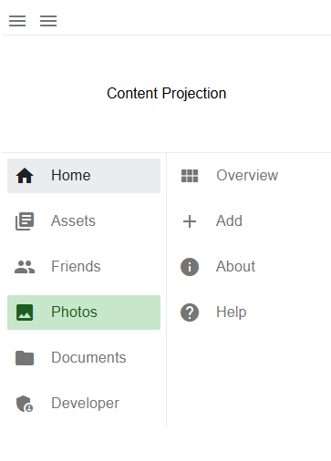
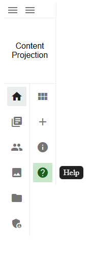

# ngx-navigation-drawer

This angular navigation drawer module features fold functionality and a dedicated panel for seamless content projection.

## Preview

  

    
Unfolded State

    
  

  

    
Folded State

    
  

## License
This project is licensed under the MIT License. See the [LICENSE](LICENSE) file for details.
